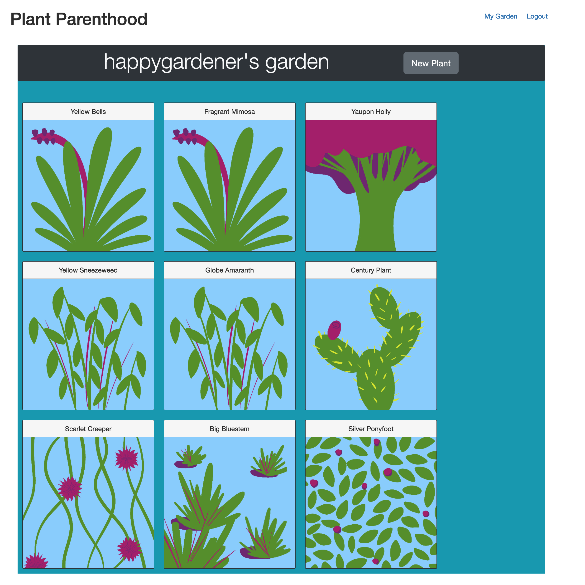
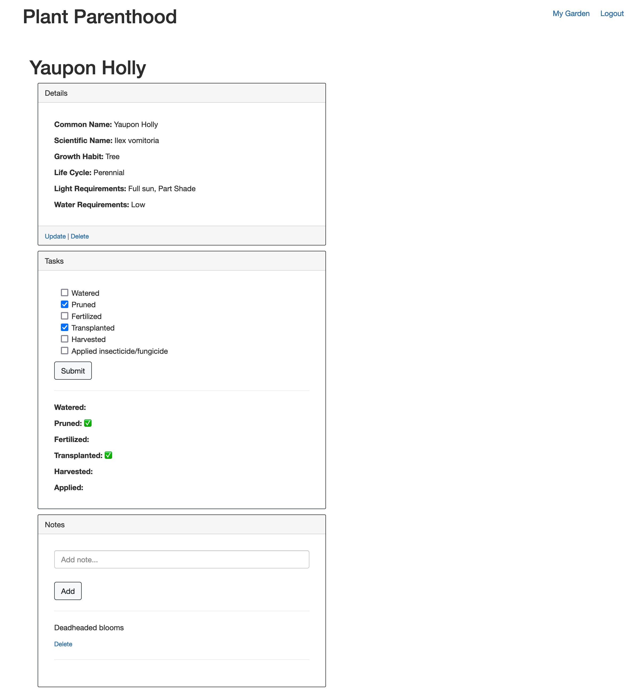

# Plant Parenthood

## Description
An app that allows gardeners to manage their plants, their garden tasks, and to record observations.

[LIVE APP - Heroku](https://obscure-mountain-85382.herokuapp.com/)  
  
## Table of Contents
- [Screenshots](#screenshots)
- [Contributing](#contributing)
- [License](#license)
  
## Screenshots

 
## Contributing
[Emre Taskale](https://github.com/EM-T-Shells), [Alex Berger](https://github.com/aberger3647), [Heather Korczynski](https://github.com/hkorczynski), [Jonathan Vera](https://github.com/JTVera)

  
## License
Learn more about [MIT](https://choosealicense.com/licenses/mit/).
